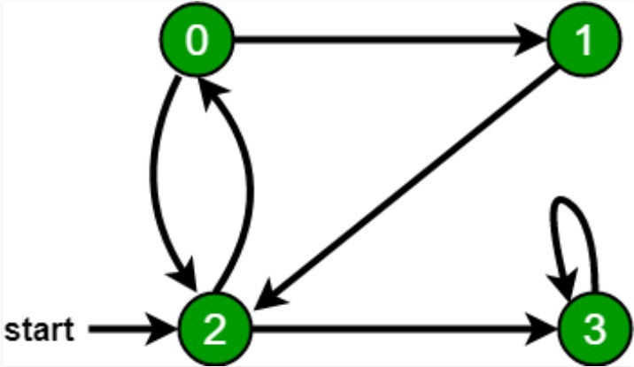

# BFS(Breadth First Search)

Breadth first search is a graph traversal algorithm that starts traversing the graph from root node and explores all the neighbouring nodes. Then, it selects the nearest node and explore all the unexplored nodes. The algorithm follows the same process for each of the nearest node until it finds the goal.

The algorithm of breadth first search is given below. The algorithm starts with examining the node A and all of its neighbours. In the next step, the neighbours of the nearest node of A are explored and process continues in the further steps. The algorithm explores all neighbours of all the nodes and ensures that each node is visited exactly once and no node is visited twice.

**Step 1:** SET STATUS = 1 (ready state)
for each node in G

**Step 2:** Enqueue the starting node A
and set its STATUS = 2
(waiting state)

**Step 3:** Repeat Steps 4 and 5 until
QUEUE is empty

**Step 4:** Dequeue a node N. Process it
and set its STATUS = 3
(processed state).

**Step 5:** Enqueue all the neighbours of
N that are in the ready state
(whose STATUS = 1) and set
their STATUS = 2
(waiting state)
[END OF LOOP]

**Step 6:** EXIT
## Graph Taken

  